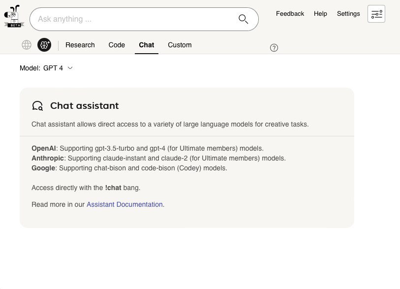
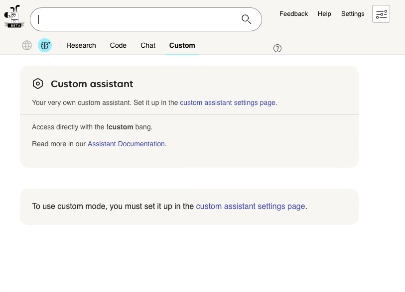

# Assistant

Kagi Assistant is a product feature backed by Kagi Search and large language models.

> Kagi Assistant is currently in closed beta and rolled out daily to Ultimate plan members. Assistant will be available soon for all members.

## Assistant Modes

### Research

Research assistant uses Kagi search and external sources like Wolfram Alpha, together with an AI model to answer your queries.

{width=500px data-zoomable}

This mode is available in two variants:

- `Fast`: Kagi search coupled with a fast LLM (`claude-instant`). Optimized for speed, while not sacrificing quality. Access directly with the `!fast` bang.
- `Expert`: Multiple Kagi searches (and external services) together with the best available LLM (`claude-2`) for the highest accuracy and comprehensive responses. Access directly with the `!expert` bang.

### Code

Code assistant is tuned for programming tasks and uses a powerful AI model for programming.

{width=500px data-zoomable}

For Starter and Professional members this mode uses `gpt-3.5-turbo`, and for Ultimate members it uses `gpt-4`.

Access directly with the `!code` bang.

### Chat

Chat assistant allows direct access to a variety of large language models for creative tasks.

{width=500px data-zoomable}

This mode supports the following models:

- OpenAI
  - `gpt-3.5-turbo`
  - `gpt-4` (for Ultimate members)
- Anthropic
  - `claude-instant`
  - `claude-2` (for Ultimate members)
- Google
  - `chat-bison`
  - `code-bison` (Codey)

Access directly with the `!chat` bang.

### Custom

Custom assistant allows you to further customize one of the existing modes.

{width=500px data-zoomable}

Select the base mode (and variant/model where applicable) and add your own custom instructions. Setup is detailed in the [Assistant settings help page](../settings/assistant.md#custom-assistant).

Access directly with the `!custom` bang.
