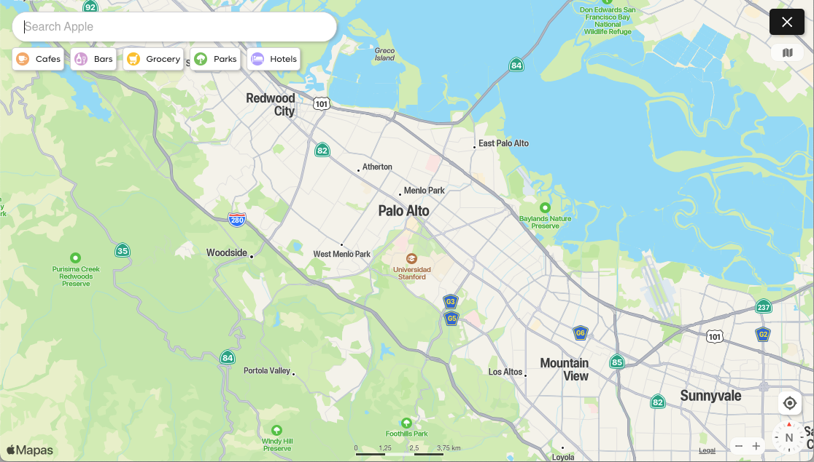
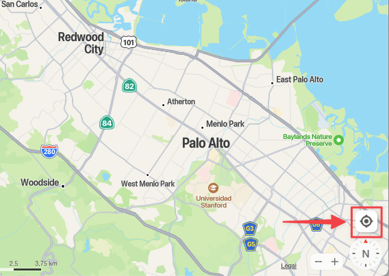
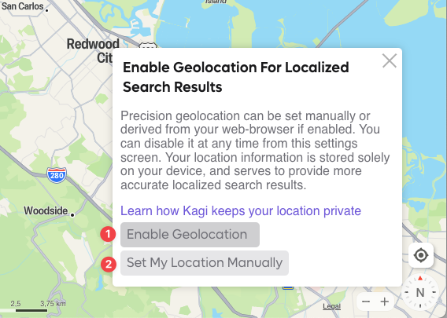
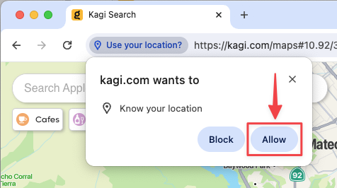
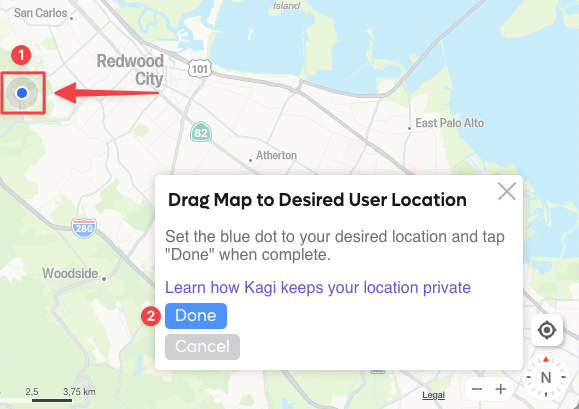
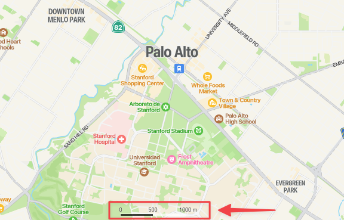

# Kagi Maps

[Kagi Maps](https://kagi.com/maps) is a powerful tool that simplifies the process of finding businesses, points of interest, and addresses. With Kagi Maps, you can easily search for locations, get driving or walking directions, and discover interesting stops along your route.

{width=675px data-zoomable}

## Kagi Basemap Options

{data-zoomable}

A basemap is the underlying map that provides the background and context for the data layers you add on top of it. Kagi Maps offers three basemap options to suit your preferences and needs:

- **Apple Maps**. This is the default basemap and currently offers the most features, such as driving directions.
- **Kagi Basemap**. Provides greater detail, readability, and map comprehension by using 3d landmarks, trees, shadows and improved labeling.
- **OpenStreetMap**. An open-source, community-driven basemap optimized for speed and a lightweight map search experience.

## Enabling Geolocation

By default, Kagi Maps uses your IP address to determine your approximate location and use it as the initial location of the map.

For a better experience while using Kagi Maps, we recommend sharing your geolocation with Kagi Maps. Your location will only be saved in your browser’s storage and will not be associated with your account. To do this, click or tap on the Geolocation button:

{width=500px data-zoomable}

You will be presented with two options to set your location:

1. The first one is to use your browser’s built-in geolocation function to automatically identify and share your real time location with Kagi Maps.
2. You can also set your location manually by clicking the **Set My Location Manually** button.

{width=500px data-zoomable}

If you opted to use your browser’s built-in geolocation, your browser might prompt you to give Kagi permission to detect your location, please click the **Allow** button:

{width=500px data-zoomable}

If you chose the **Set My Location Manually** option, you will be able to drag the map so that the blue dot is positioned in your location, then click on **Done**.

{width=500px data-zoomable}

## Changing Kagi Maps Unit System

Kagi Maps allows you to change the unit system used for displaying distances. You can choose between metric units (kilometers and meters) or imperial units (miles and feet). To change the unit system, simply click on the scale bar at the bottom of the screen.

{width=500px data-zoomable}

Clicking on the scale bar will toggle between metric and imperial units. The scale bar will update to reflect the selected unit system, and any distances shown in Kagi Maps, such as route lengths, will be displayed using the chosen units.

Changing the unit system can be helpful if you are more comfortable with a particular system or if you need to match the units used in other applications or documents.
