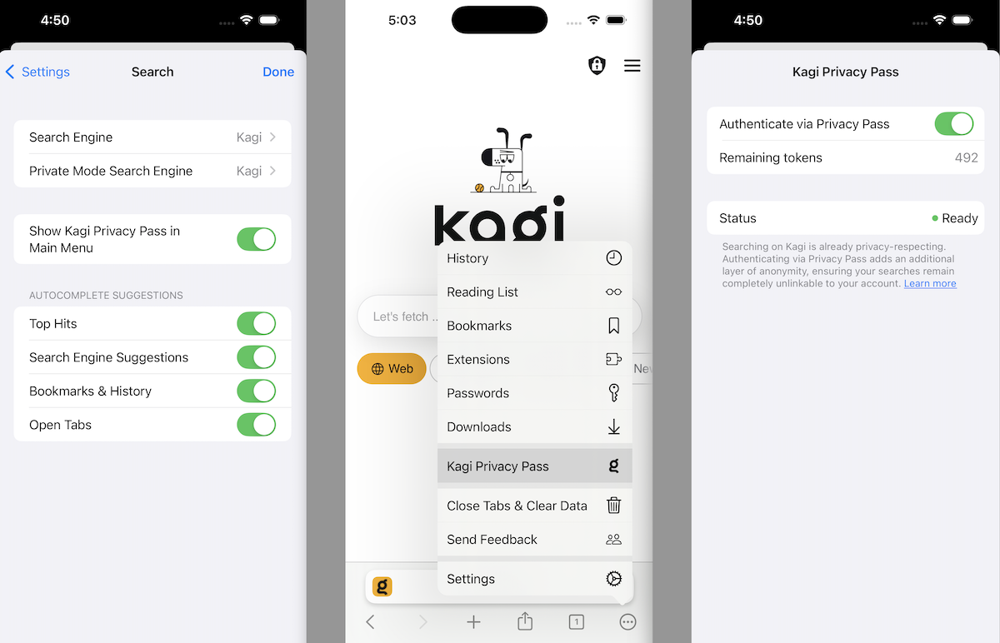
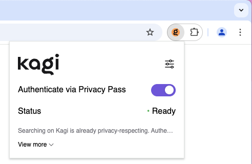

# Kagi Privacy Pass

## What is Kagi Privacy Pass?

**Privacy Pass** is a powerful privacy feature that allows you to use Kagi Search without revealing your identity. When enabled, it lets you perform searches anonymously while still verifying that you're a valid Kagi subscriber. Think of it as a digital token system - similar to getting tokens at an arcade, where once you have them, you can use the services without showing your ID each time.

## How does it work?

When you enable Privacy Pass, instead of logging in with your Kagi account for each search, you use special cryptographic tokens. These tokens prove you have the right to use Kagi's services without revealing who you are. This means your searches can't be linked back to your account, providing an additional layer of privacy. Learn more about the technical details in the [blog post](https://blog.kagi.com/kagi-privacy-pass).

## Getting started

To start using Privacy Pass, you'll need an active Kagi membership (Professional, Ultimate, Family, or Team plan). This feature is currently not available for Starter plan subscribers.

Select your browser for set up instructions:

Google Chrome / Microsoft Edge / Brave / Vivaldi / Opera

1. First, make sure you're logged into your Kagi account, this is needed to generate Privacy Pass tokens.
2. Install the [Kagi Privacy Pass extension](https://chromewebstore.google.com/detail/kagi-privacy-pass/mendokngpagmkejfpmeellpppjgbpdaj?hl=en-US)
3. For easy access, pin the extension to your browser’s toolbar.

<video src="./media/kagi_privacy_pass_chrome.mp4" width="720" type="video/mp4" autoplay muted loop playsinline disablepictureinpicture />

Firefox / Tor Browser

1. First, make sure you're logged into your Kagi account, this is needed to generate Privacy Pass tokens.
2. Install the [Privacy Pass extension](https://addons.mozilla.org/en-US/firefox/addon/kagi-privacy-pass/)
3. For easy access, pin the extension to your browser’s toolbar.

<video src="./media/kagi_privacy_pass_firefox.mp4" width="720" type="video/mp4" autoplay muted loop playsinline disablepictureinpicture />

**Note for Tor users:** Currently Privacy Pass is only supported via the kagi.com domain name, support for our Onion address will be added in a future update.

Orion for Mac

1. First, make sure you're logged into your Kagi account, this is needed to generate Privacy Pass tokens.
2. From your menu bar, go to **Orion** > **Settings** > **Search**.
3. Make sure Kagi is selected as your search engine.
4. Enable the **Show Kagi Privacy Pass on Toolbar** checkbox.
5. Click the Kagi Privacy Pass extension icon in the toolbar.
6. Make sure the **Authenticate via Privacy Pass** toggle is enabled.

<video src="./media/kagi_privacy_pass_orion_mac.mp4" width="720" type="video/mp4" autoplay muted loop playsinline disablepictureinpicture />

Orion for iOS

1. First, make sure you're logged into your Kagi account, this is needed to generate Privacy Pass tokens.
2. Tap the three dots at the bottom right corner and select **Settings**.
3. Tap on **Search**.
4. Enable the **Show Kagi Privacy Pass in Main Menu** toggle.
5. Tap **Done**.
2. Tap the three dots at the bottom right corner and select **Kagi Privacy Pass**.
3. Make sure **Authenticate via Privacy Pass** is enabled.

{width=700px data-zoomable}

Safari

Due to restrictions imposed by Apple, Privacy Pass is not supported in Safari at this time.

If you're looking for a native WebKit-based browsing experience with Privacy Pass support, try [Orion](https://kagi.com/orion/) - it includes Privacy Pass integration out of the box along with zero telemetry, ad-blocking, and many other privacy-focused features.

## Using Privacy Pass

After installation, Privacy Pass is automatically enabled. You can easily turn it on or off by clicking the extension icon in your browser's toolbar and toggling the **Authenticate via Privacy Pass** option.

{width=700px data-zoomable}

When enabled, you'll notice that certain settings and features such as custom bangs and lenses, as well as personalized results, aren't available - this is intentional to maintain your anonymity.
                
{width=700px data-zoomable}

The extension will automatically manage your tokens, generating new ones when needed. You can always switch back to normal authentication by turning off the "Authenticate via Privacy Pass" toggle in the extension popup.

## Important notes

- The extension will fetch 500 tokens at a time.

- There's a monthly limit of 2,000 tokens per account to prevent abuse. If you need more tokens in exceptional cases, please contact us at support@kagi.com.

- While using Privacy Pass, your customized settings won't be available since this would make your searches potentially identifiable. However, basic features like theme preferences will still work as they're stored locally in your browser.

## Troubleshooting

If you see a "Generate more tokens" button, it usually means the extension couldn't generate tokens automatically. This can happen if you were:
- Not logged into your Kagi account
- Offline when the extension tried to generate tokens
- Have reached your monthly token limit

Simply ensure you're logged in and online, then click the "Generate more tokens" button to try again. If you continue experiencing issues, please reach out to our support team at support@kagi.com.
