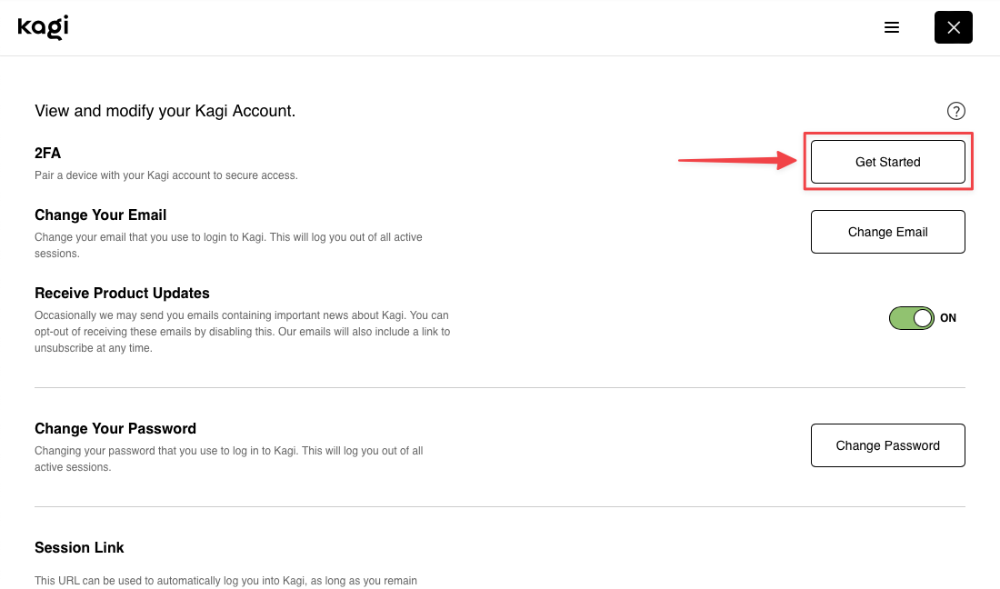
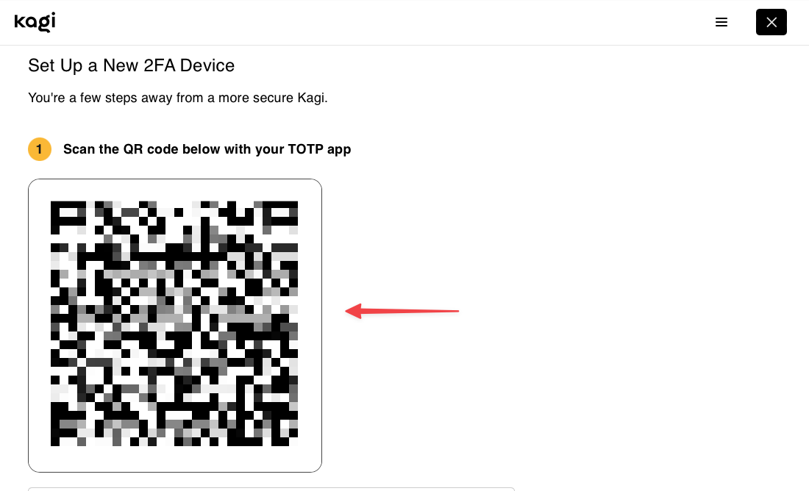
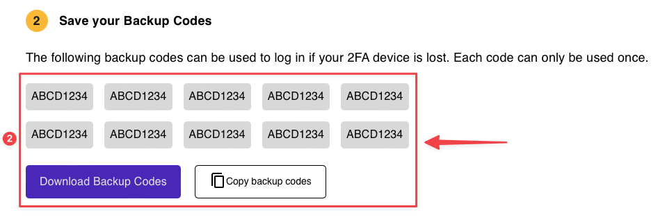
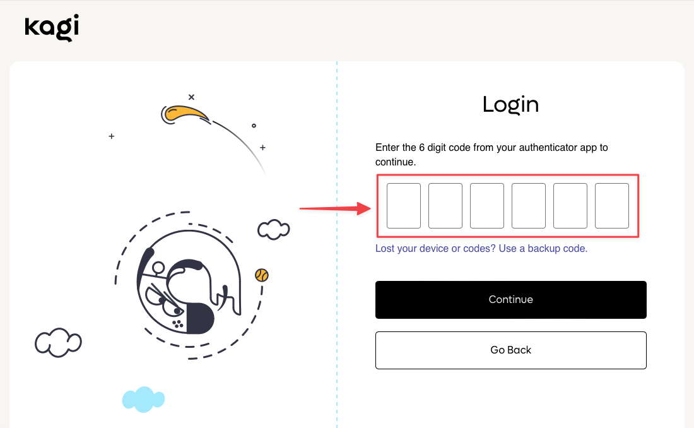
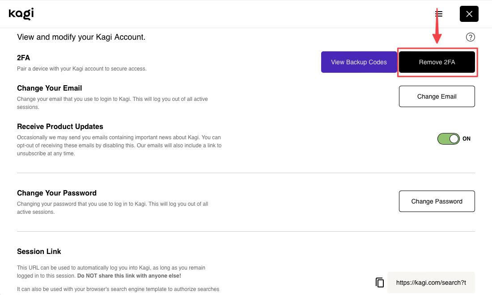

# Two-Factor Authentication (2FA)

One of the best ways to protect your Kagi account is to set up two-factor authentication (2FA), this allows you to use an authenticator app to generate a verification code that will be requested every time you sign in to your account.

In the event that your account password was compromised, attackers wouldn’t be able to log in to your account as they would be required to enter the verification code generated by your authenticator app.

## Authenticator Apps

Kagi’s 2FA implementation is compatible with most authenticator apps, some options are provided below:

iOS:
- [2FAS Authenticator](https://apps.apple.com/us/app/2fas-auth/id1217793794) (Open Source)
- [OTP Auth](https://apps.apple.com/us/app/otp-auth/id659877384)  
- [Google Authenticator](https://apps.apple.com/us/app/google-authenticator/id388497605)  
- [Microsoft Authenticator](https://apps.apple.com/us/app/microsoft-authenticator/id983156458)  

Android:
- [2FAS Authenticator](https://play.google.com/store/apps/details?id=com.twofasapp) (Open Source)
- [Aegis Authenticator](https://play.google.com/store/apps/details?id=com.beemdevelopment.aegis&hl=en&gl=US)
- [Google Authenticator](https://play.google.com/store/apps/details?id=com.google.android.apps.authenticator2&hl=en&gl=US)
- [Microsoft Authenticator](https://play.google.com/store/apps/details?id=com.azure.authenticator&hl=en&gl=US)

Cross-Platform: [Ente Auth](https://github.com/ente-io/ente/tree/main/auth#readme)

Some password managers such as 1Password and Bitwarden also have a 2FA authenticator built-in.

## Setting up 2FA authentication

If you want to set up 2FA authentication in your Kagi account, first visit the [Account Settings](https://kagi.com/settings?p=user_details) page. Then, click the **Get Started** button.

{width=600px data-zoomable}

On the next screen, a QR code will be displayed. You can scan this QR code from your favorite authenticator app.

{width=600px data-zoomable}

If you are using a desktop app to generate the verification codes, then it might be easier to copy your setup key and paste it in your authenticator app directly.

{width=600px data-zoomable}

As a way to prevent from being locked out from your account, we recommend you download and store your backup codes safely, these can be used to regain access to your account if you lose access to your authenticator app.

{width=600px data-zoomable}

Finally, enter the verification code generated by your authenticator app in the boxes to complete the setup process and then click **Continue**.

{width=600px data-zoomable}

## Sign-in with 2FA authentication

If you have 2FA authentication enabled in your account, you will prompted to enter your verification code after entering your username and password.

{width=600px data-zoomable}

## Disabling 2FA authentication

If you need to disable 2FA authentication for your account, first visit the [Account Settings](https://kagi.com/settings?p=user_details) page. Then, click the **Remove 2FA** button.

{width=600px data-zoomable}
